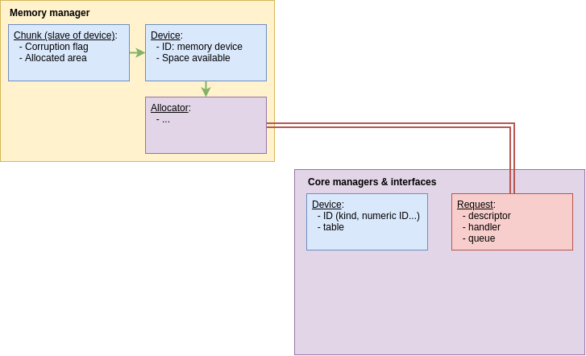

## Memory management (Mem)

### The chunk

Users are working in chunks, that is to say, the only memory link they directly
share with the memory management system is the chunk interface. A chunk is a
range of allocated memory concretely defined by the [memory device](#the-memory-device),
dedicated to a process.

### The memory device

The memory device is the base of the memory system. It can be viewed as a simple
physical volatile memory component, that has no direct abstract utility. The
memory device must respect the device ID specified in the [device interface of
the core](#the-device-interface). It is linked to an allocator.

### The allocator

To link the core system to the memory management system, we need to use an
allocator. The given name of this component is not enough precise: the allocator
does not allocate memory in itself, but it will communicate with the core to
handle all allocation-based requests. If a user needs more memory to make his
process work properly, the information will be sent to the device, and the device
give it the the allocator. The allocator gathers all usefull informations to
make a complete request (device ID, request nature, reason of the request, etc.),
and it will send it to the [request management section of the core](#the-request-manager).

The below pattern represents the request transfer process:
* If a user needs to perform actions that need some memory management
  * He calls a system API:
    1. The call will transmit the management request to the device
    2. The device will forward it to the memory allocator
    3. The memory allocator will formulate a precise request that will be sent to
    the request manager of the core system.

## Core interfaces & managers (Core)

### The request manager

This component allows all devices to communicate with the core. It means that,
every actions on the VM will go through this manager, without exception. To
perform a request, all components must respect a [request format specification](request_format.md)
. This kind of request will firstly be stocked in a request queue, then it will
be handled as defined by the driver's developers. A result will be sent back to the request
sender as a handle, it will contain all relevant informations about the done request
treatment.

### The device interface

All devices in the VM are based on this interface. Hence, all these devices have
one thing in common, the device ID:
  * A *device kind* specifying the class of the device, for instance, a memory 
  device has the kind `vm::DeviceKind::MEMORY`.
  * A unique numeric ID to identify each device of a given kind. (note: the
  numeric ID must be in the range [1;16])

## VM architecture pattern

